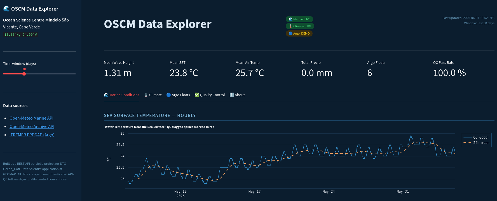

# OSCM Cape Verde — Ocean Data Explorer

**A REST API data pipeline and interactive dashboard for oceanographic data
in the Cape Verde / Ocean Science Centre Mindelo (OSCM) region.**

Built as a portfolio project demonstrating REST API skills, data harmonisation,
quality control, and interactive visualisation with marine science data.

👉 **[Live dashboard →](https://YOUR-APP-NAME.streamlit.app)**  *(replace with your Streamlit URL)*

---



## What it does

1. **Queries three free REST APIs** in real time:
   - [Open-Meteo Marine API](https://open-meteo.com/en/docs/marine-weather-api) — hourly wave height, direction, period
   - [Open-Meteo Historical Archive](https://open-meteo.com/en/docs/historical-weather-api) — daily temperature, precipitation, wind
   - [IFREMER ERDDAP (Argo)](https://erddap.ifremer.fr/erddap/tabledap/ArgoFloats.html) — float T/S profiles in the Atlantic

2. **Applies quality control** following [Argo QC conventions](https://doi.org/10.13155/33951):
   - Range checks (physically plausible bounds)
   - Spike detection (rolling-median deviation test)
   - QC flags: `1` = Good, `4` = Bad

3. **Harmonises heterogeneous datasets** — hourly marine data resampled to daily
   and merged with climate and float data into a single analysis-ready DataFrame.

4. **Visualises everything** interactively with Plotly:
   - Time series with QC-flagged anomalies highlighted
   - Argo float track map (Scattergeo)
   - T/S vertical profiles and T-S diagram
   - Correlation heatmap across all variables
   - Wave direction polar plot

## Repository structure

```
oscm_dashboard/
├── app.py            # Streamlit dashboard — all UI and chart code
├── data.py           # API fetching, parsing, QC — all data logic
├── requirements.txt  # Python dependencies
└── README.md
```

*Separation of concerns*: `data.py` contains zero UI code; `app.py` contains zero
HTTP logic. This makes the pipeline testable independently of the frontend.

## APIs and REST concepts demonstrated

| Concept | Where |
|---------|-------|
| `GET` requests with query parameters | `data.py: _get()`, all `fetch_*` functions |
| HTTP status code handling (200, 429, 5xx) | `data.py: _get()` |
| Retry with exponential back-off | `data.py: _get()` |
| JSON response parsing → DataFrame | All `fetch_*` functions |
| Paginated/limited queries (ERDDAP `.limit`) | `data.py: fetch_argo()` |
| Different response schemas (table vs nested) | Marine API vs ERDDAP |
| Authentication pattern (ready for CMEMS) | Comments in `data.py` |
| Response caching | `app.py: @st.cache_data(ttl=3600)` |

## Running locally

```bash
git clone https://github.com/YOUR-USERNAME/oscm-dashboard.git
cd oscm-dashboard
pip install -r requirements.txt
streamlit run app.py
```

The app opens at `http://localhost:8501`.

> **Note**: If the APIs are unreachable (e.g. network restrictions), the app
> automatically falls back to realistic synthetic data with identical structure,
> and shows a "DEMO DATA" badge. All chart and QC code runs identically.


## Relevance to marine data infrastructure

This project reflects real workflows in operational oceanography:

- **FAIR principles**: All source data is Findable (DOI/URL), Accessible (open REST API),
  Interoperable (standard JSON/CSV formats, CF conventions), Reusable (documented provenance).
- **NRT data streams**: The Marine and ERDDAP APIs provide near-real-time data;
  the architecture is designed to support hourly re-fetching.
- **Data fusion**: Heterogeneous sources (satellite-derived wave model, reanalysis
  climate, in-situ Argo floats) are harmonised to a common temporal resolution.
- **QC**: Automated flagging ensures downstream analyses are not distorted by
  instrument errors or transmission artefacts.

---

*Study region: 12–20°N, 20–27°W (Cape Verde / OSCM area)*  
*All APIs free and unauthenticated. No data is stored — all fetches are live.*
